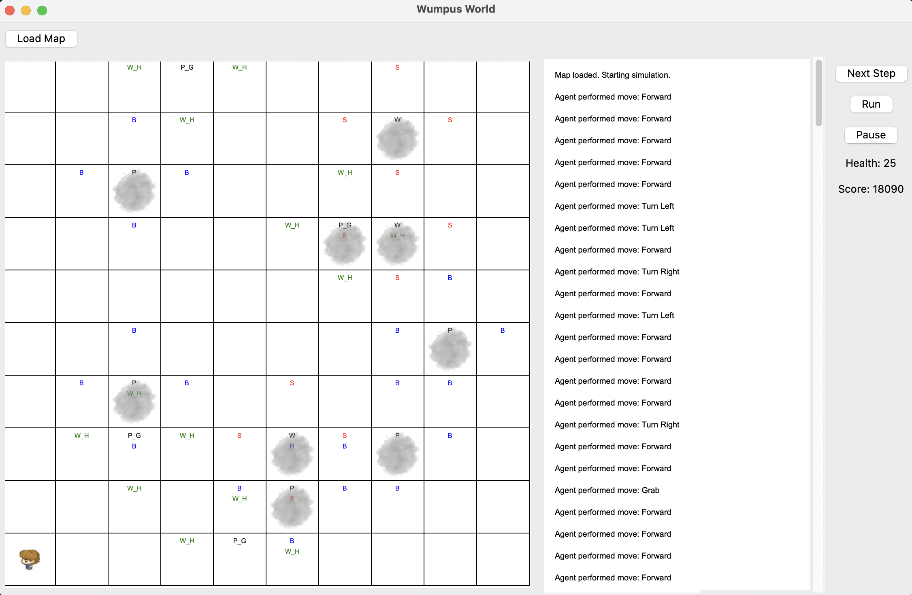

# Introduction to Artificial Intelligence: Wumpus world

**Built by:**
- Phan Hải Minh ([@hydroshiba](https://github.com/hydroshiba))
- Mai Đức Duy ([@EvDDD](https://github.com/EvDDD))
- Nguyễn Trần Minh Hoàng ([@hoangcoderne](https://github.com/hoangcoderne))
- Trần Thành Long ([@lib2509](https://github.com/lib2509))

Agents with the ability to derive new conclusions from the currently given informations instead of just using them are one step closer to intelligence. The Wumpus world is one problem that requires such abilities from an agent. In the course **CSC14003: Introduction to Artificial Intelligence**, we studied propositional logic, ways to represent them including the Conjunctive Normal Form and how we can apply them to make our agent move intelligently in the Wumpus world.

 

 

The detailed description of the project can be read in the [project description PDF](./docs/pdf/description.pdf).

## Requirements

- Python 3.8 or higher.
- `tkinter` package.
- `pysat` package.

## How to run

- Clone the repository.
- Install the `tkinter` and `pysat` packages if you haven't already.
- Execute the `main.py` file in the repository directory with Python.

To see how the program works, watch our [demo video](https://drive.google.com/drive/folders/1XIPGlaM1SMt5O8nxttCfa-f0JLqRgxES?usp=sharing)

## Project details

For a detailed description on each of the algorithms used in each level of the project, as well as the testcases used to test these algorithms, read the [project report](./docs/pdf/report.pdf).